

매일 사용한 금액을 확인하며, 엑셀에 가계부를 일일히 적는 건 매우 귀찮았다. 미루는 날이 대부분이고 작심 3일에 의지박약이 아닌가 하는 의구심 마저 들었다. 평소에도 귀찮아서 단축어를 자주 사용하는 앱등이다. 하루가 귀찮다. 다들 어떻게 그렇게 열심히 사는걸까.

# 메시지 클립보드에 복사
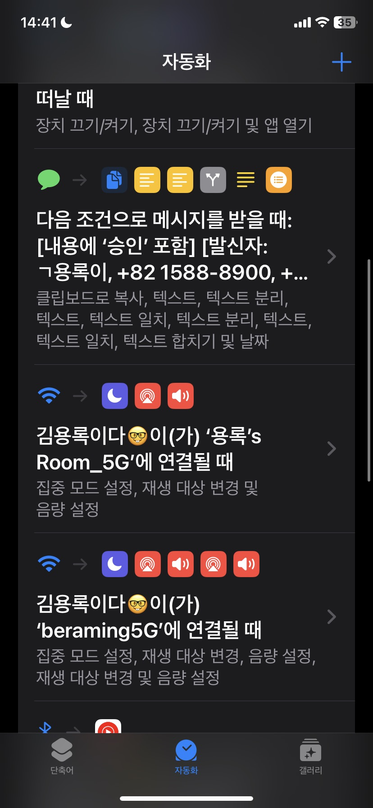 
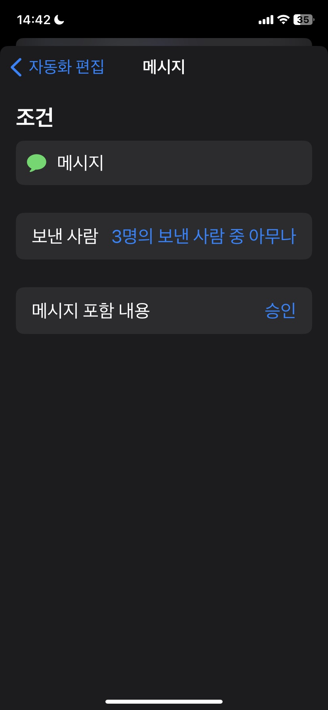 

- 보내는 사람을 설정해야 한다. 나는 크게 신용카드와 체크카드 두 가지 만 사용한다. 그리고 나 자신을 넣었다. 그 이유는 마지막에 설명하겠다.

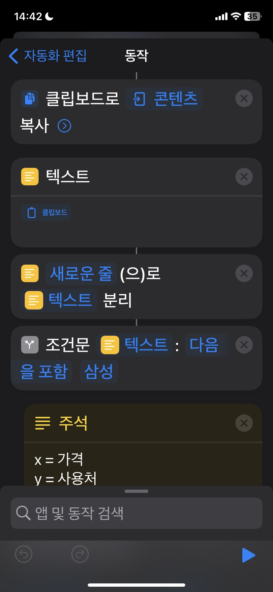
 
- 클립 보드에 나에게 보내진 메세지를 받아온다. 그리고 줄 바꿈 별로 분할했다. 인데스 별로 사용한 금액 그리고 사용처를 알기 위함이다.

# 사용처와 사용금액
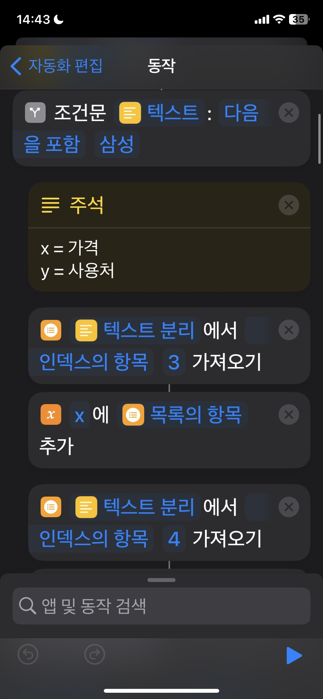 
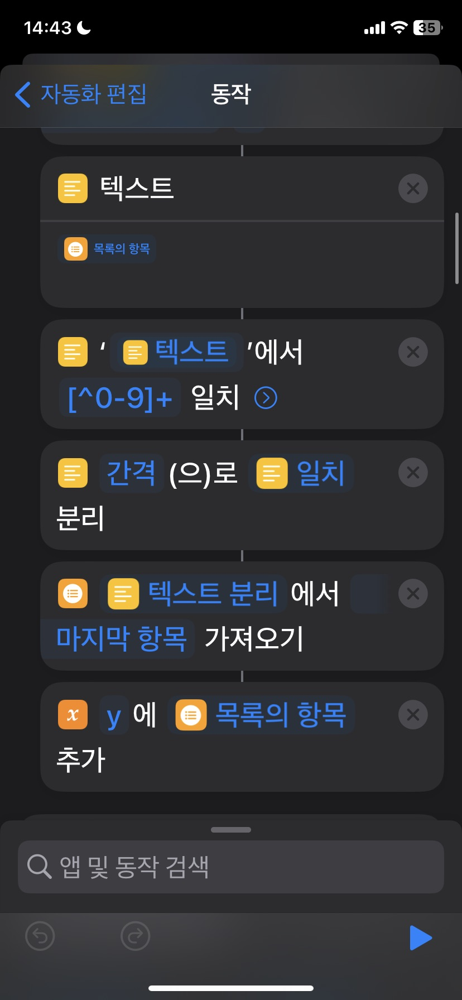 
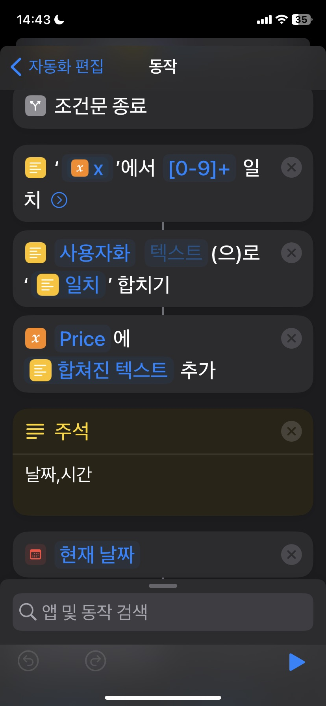  

- 첫 번째 조건문은 사실 크게 신용카드을 따로 찾고자 그렇게 진행하였다. 물론 카드사 별로 문자 방식이 다르면 따로 바꿔 줘야 할 것 같다.

# 닐찌 장보
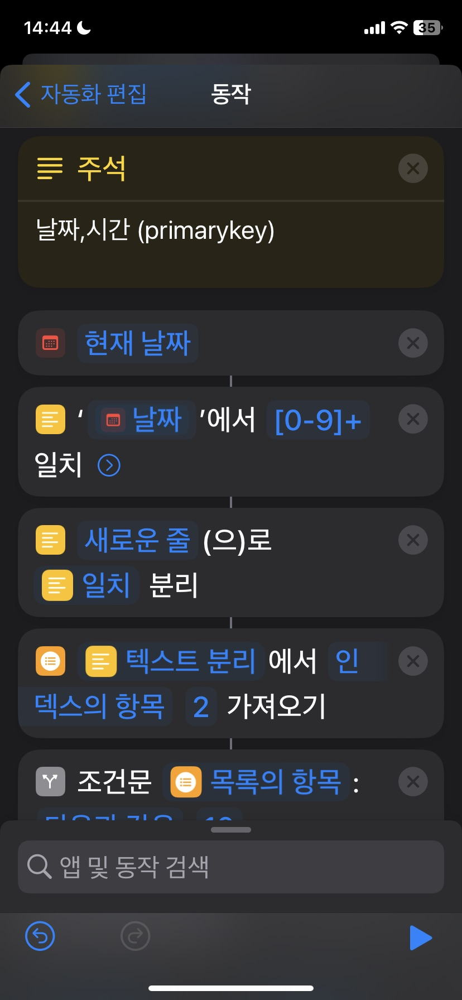 
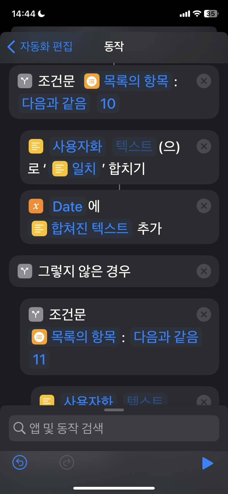 
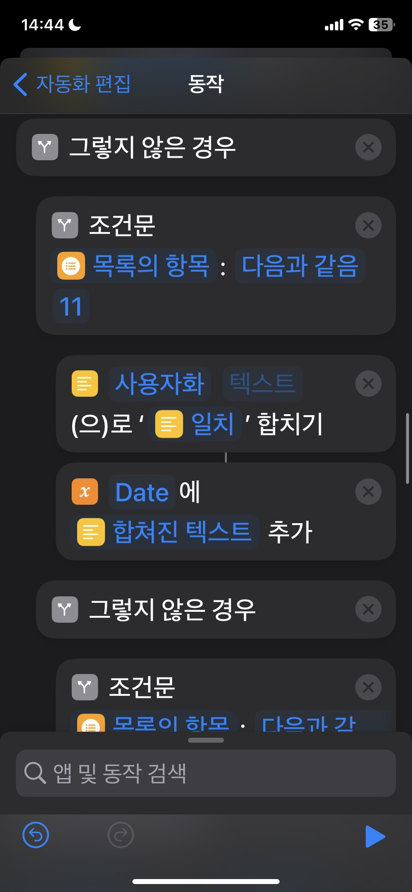 

- 솔직히 날짜는 노가다였다. 확인은 안해봤지만 현재 날짜, 아마도 내 핸드폰 세션 기준으로 받아오는 거 같다. 방식은 간단하다. 글을 작성하면서 생각해보니 일도 마찬가지 겟지만, 한 자리 수 달은 0이 생략되서 한 자리로 나온다. 따라서 10월 >= 이런 식으로 조건문을 달았다면 훨신 쉽게 했을 것이다. 그러나 방법을 모르겠다...

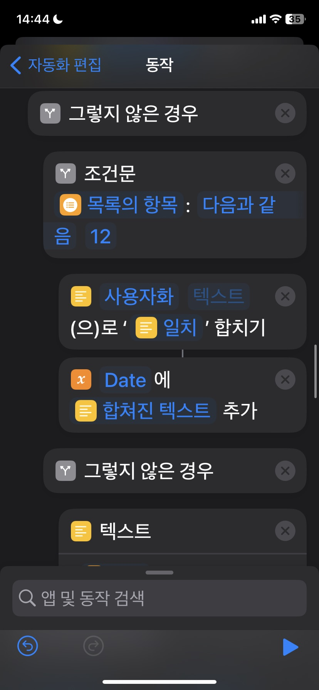 

- 그래서 여기 보면 10월 11월 12월을 따로 해뒀다. 방법을 찾고 싶은데 정보가 별로 없었다.

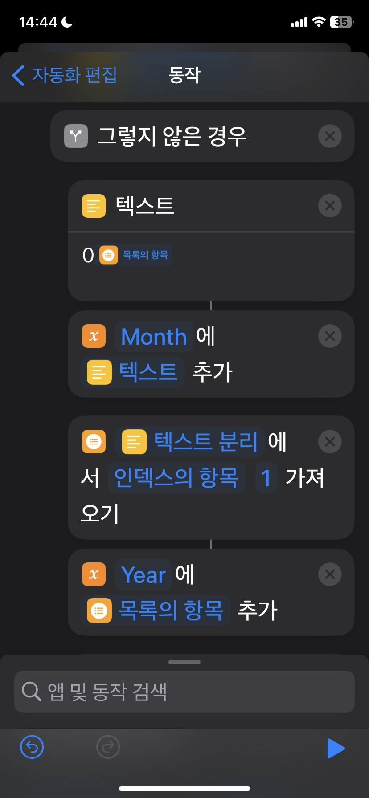 
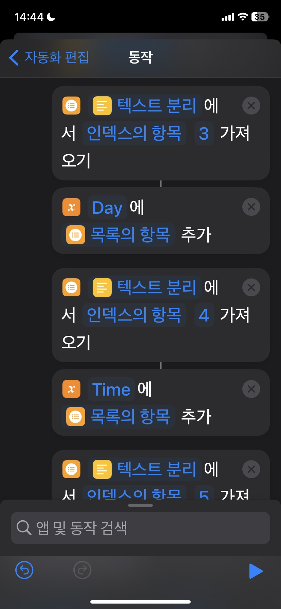 
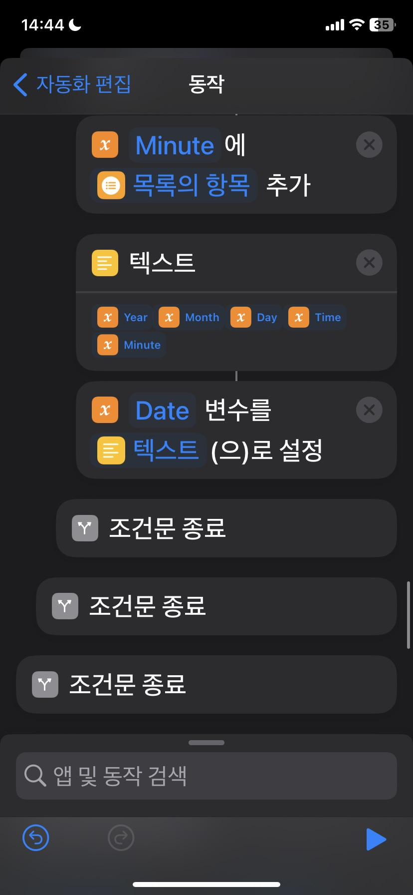 

- 그리고 한 자리 수의 달일 때, 분할한 인덱스에 각각 변수에 저장해서 마지막 텍스트로 한 번에 합쳤다. 엄청난 노가다다.

# 위치 정보
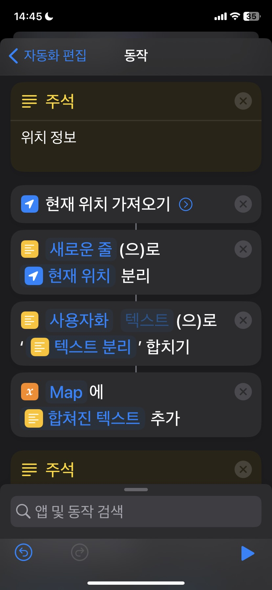 
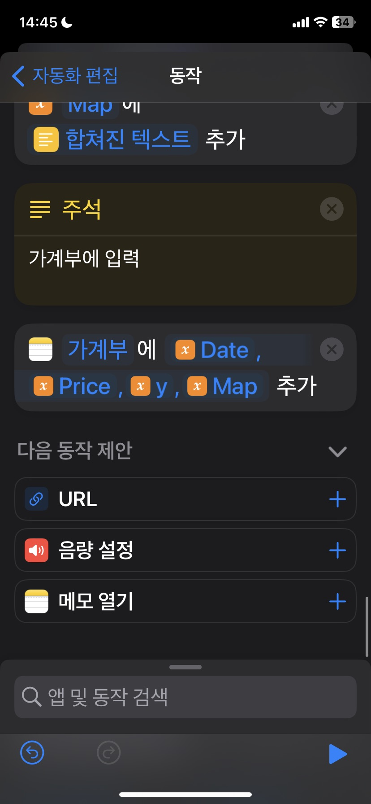 

- 마지막으로 위치 정보를 받아온다. 혹시나 모를 도용? 그런 것을 확인하고자 넣었다. 그리고 텍스트 파일을 엑셀 파일로 확장자 변환하기 쉽게 형식(, , ,)을 짜놨다.

# 사용 해보기
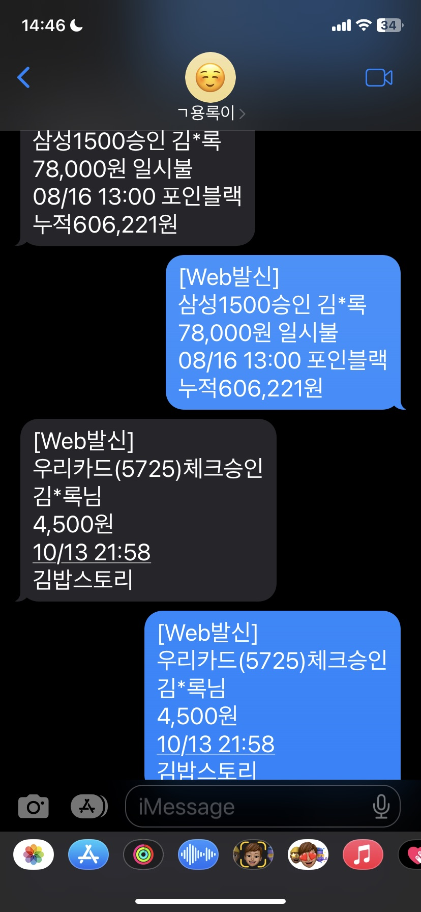 

- 이렇게 테스트로 신용카드와 체크카드 결제 내역을 붙여넣기 해보았다. 

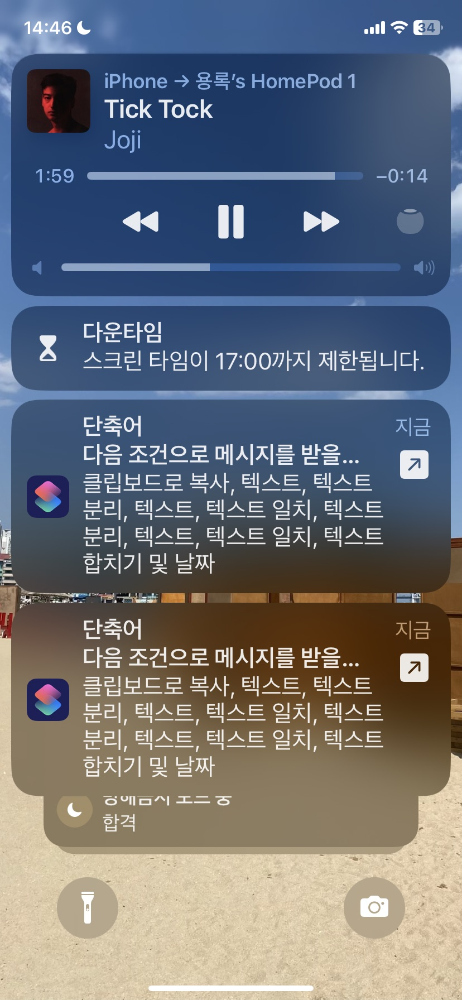 
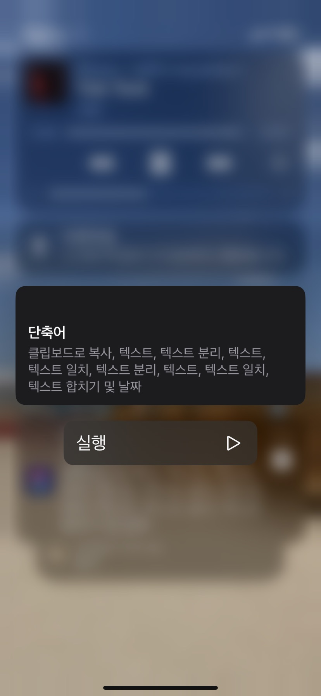
 
 - 두 개를 한 번에 보낼 떄, 승인하게 되면 승인한 단축어 만 실행되고 나머지 하나는 사라지게 된다. 생각과는 다른 착오다. 이게 다른 단축어는 허가 없이 자동 실행이 가능하게 가능한데 메시지를 받아오는 건 승인이 필요한가 보다. 

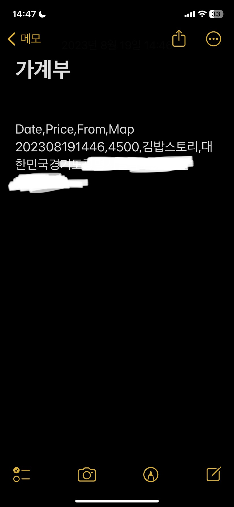 

- 내 메모장에 하나 만 들어온 것을 확인할 수 있다. 이것을 어떻게 보완활 수 있을까 고민하다가,

# 결과적으로
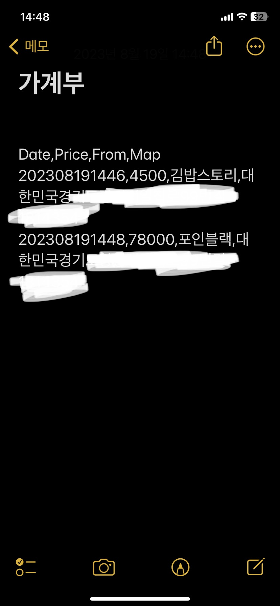 

- 그래서 전화번호 리스트 중 내 번호를 추가한 이유다. 미처 승인하지 못한 내 결제 내역을 나한테 보내기 위함이다.

이걸 해결할 수 있는 방법을 생각해봐야겠다.
